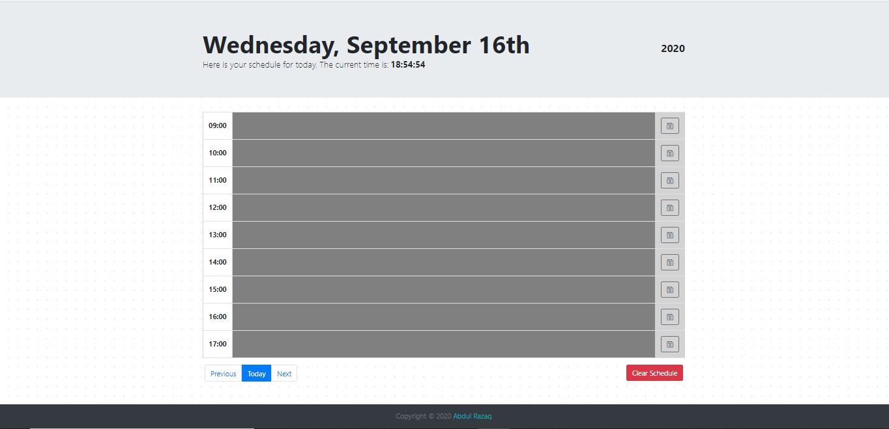

The files contained are for work day planner that pans out a traditional work day, ranging from 0900 to 1700, that is created using HTML, JavaScript as simplified through jQuery, and incorporated usage of Moment.js library for the effective display of date and time. Events serve as placeholders for a users agenda and can be entered in the row corresponding to the time, which can then be saved, making it so that the saved changes will be retained upon a browser refresh, unless the "clear changes" option is selected. The color/focus of the row changes with the time with grey indicating times past, a lighter blue corresponding to the current hour, and a darker blue for events, or times, that fall into neither of the categories pertaining to the other two color-coded categories. 

<a href="https://razaqabdul8.github.io/work_day_scheduler">Link to "Work Day Scheduler"</a>
